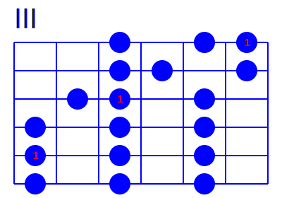

# fretty-book

fretty-book can replace inline [fretty](https://github.com/thomasvolk/fretty) markup within documents with the generated images.

## Installation

    pip install fretty-book

## Usage

    fretty-book example/simple.html -o simple.html

## Supported formats

fretty-book can process HTML, XHTML, Markdown, and Org-mode documents. The format is detected automatically from the file extension (`.html`, `.htm`, `.xhtml`, `.md`, `.org`) or can be set explicitly with the `-p` option.

## Markup

All fretty blocks support the following attributes:

| Attribute | Description | Default |
|---|---|---|
| `width` | Image width in pixels | auto |
| `height` | Image height in pixels | auto |
| `drawing_color` | Color of strings, frets, and dots | `black` |
| `label_color` | Color of finger-position labels | `white` |

### HTML

```html
<!DOCTYPE html>
<html>
    <body>
        <h3>C major scale</h3>
        <fretty width="400" drawing_color="blue" label_color="red">
            III
            --o-o1
            --oo-o
            -o1-o-
            o-o-o-
            1-o-o-
            o-o-o-
        </fretty>
    </body>
</html>
```

### XHTML

Same as HTML but using a `.xhtml` file extension. The document must be well-formed XML.

### Markdown

Use a fenced code block with the `fretty` language tag. Attributes are written as `key=value` pairs on the opening fence line:

````markdown
## C major scale

```fretty width=400 drawing_color=blue label_color=red
III
--o-o1
--oo-o
-o1-o-
o-o-o-
1-o-o-
o-o-o-
```
````

### Org-mode

Use a `#+begin_src fretty` source block. Attributes follow standard Org header-arg syntax (`:key value`):

```org
* C major scale

#+begin_src fretty :width 400 :drawing_color blue :label_color red
III
--o-o1
--oo-o
-o1-o-
o-o-o-
1-o-o-
o-o-o-
#+end_src
```

## Options

    fretty-book [options] input_file

| Option | Description |
|---|---|
| `-o FILE` | Write output to FILE instead of stdout |
| `--png` | Save images as PNG files instead of SVG |
| `-e, --embed-svg` | Embed SVG directly into the document (HTML and XHTML only) |
| `-p TYPE` | Force processor: `html`, `xhtml`, `markdown`, `org`, or `auto` (default) |
| `-V` | Verbose output |

## Result

For each fretty block, fretty-book produces:

- An external image file (`fretty-0.svg`, `fretty-1.svg`, …) written next to the output file, with the block replaced by an image reference
- Or, with `--embed-svg` (HTML/XHTML only), the SVG is inlined directly into the document

The generated image for the C major scale example above:


